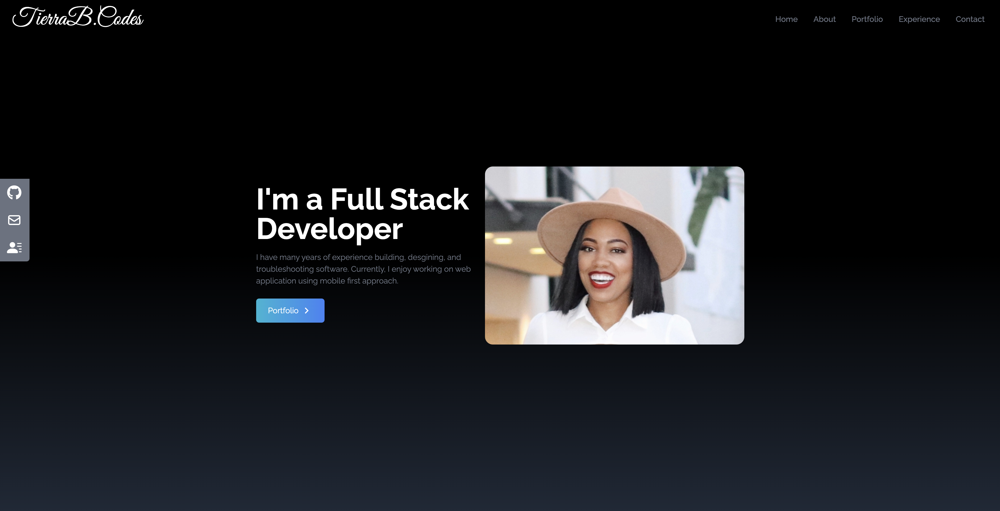

# Career Portfolio

 

## Highlights

- This portfolio will concise of my top selected projects for potential employers and clients to review.

### Skills

#### My projects includes, but not limited to:

 

Author: Tierra Barrow
